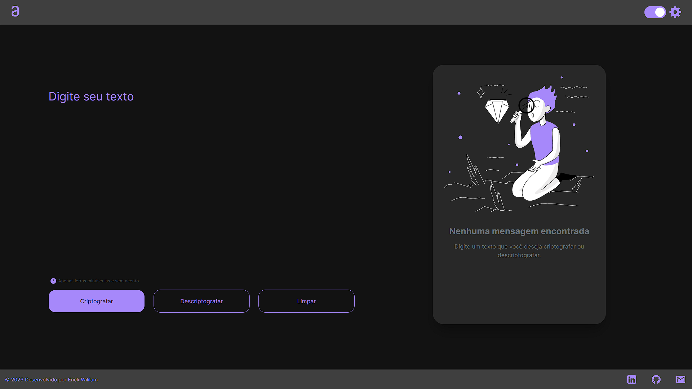
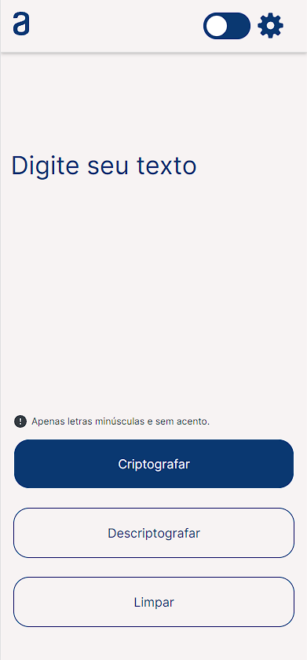
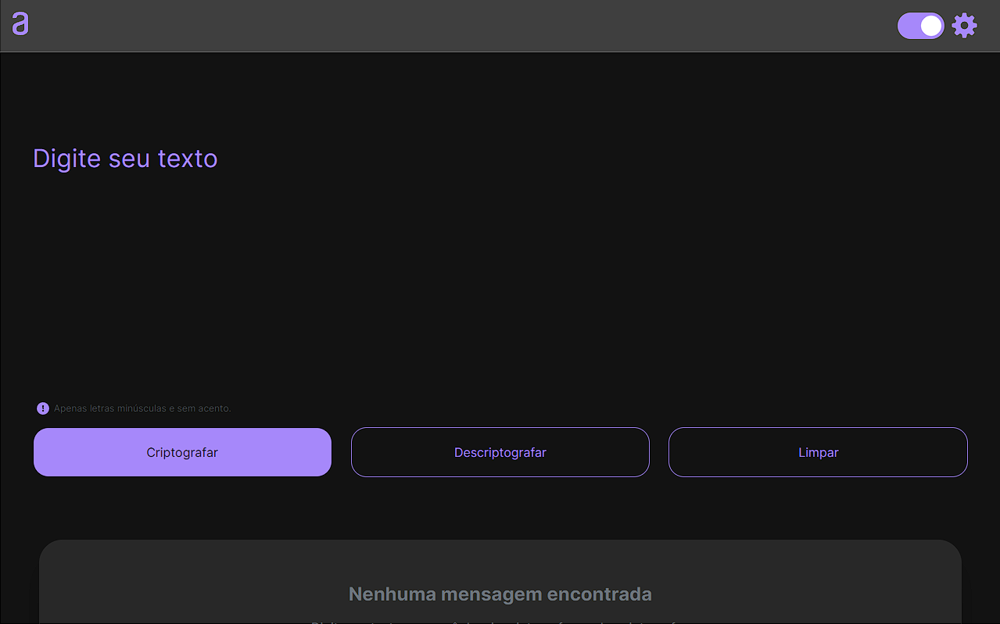
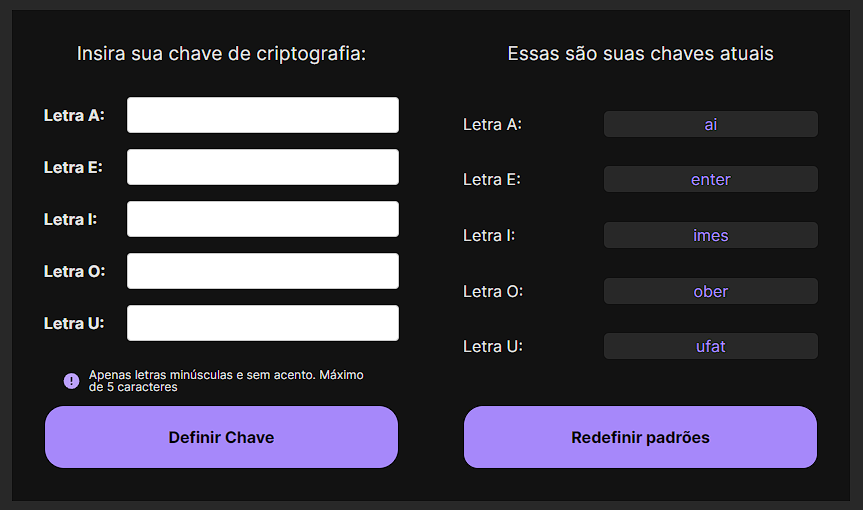
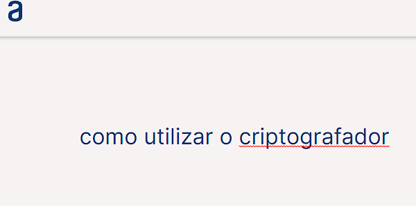
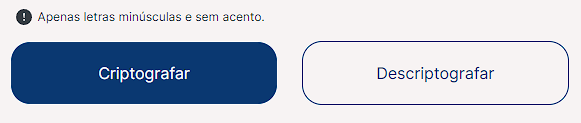
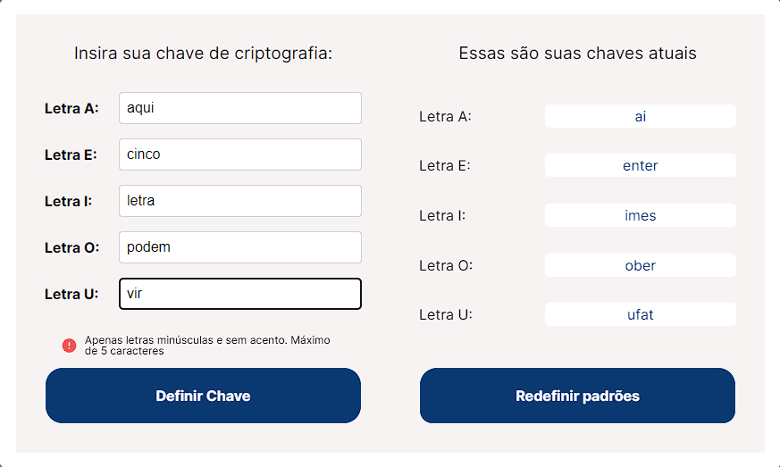

# Projeto Frontend codificador/decodificador

Este é um projeto criado para atender ao primeiro desafio proposto pela Turma 5 da ONE em parceria com a Alura. O objetivo era criar um criptografador/decriptografador que utilizasse as seguintes chaves:

-   Letra A: ai
-   Letra E: enter
-   Letra I: imes
-   Letra O: ober
-   Letra U: ufat

Foi disponibilizado um modelo figma como referência, mas tivemos liberdade criativa para desenvolver o projeto.

Além do que foi pedido, foi incluída uma função que permite ao usuário definir suas próprias chaves para as vogais, se desejar. Também foi criada uma função para modo escuro, sem a utilização de frameworks, apenas com HTML, CSS e Javascript. O Sweet Alert 2 foi utilizado para criar dois alertas.

O site é composto por uma área de texto à esquerda e uma área de resultados à direita. Ele foi desenvolvido usando a abordagem de mobile-first, onde o site é primeiro desenvolvido para versão mobile, seguido das versões para tablets, e versões de desktop ao final.

 
*Respectivamente as versões de mobile e tablet, uma em sua versão de modo claro e outras em sua versão de modo noturto*

## Funcionalidades

-   Criptografar e decriptografar texto utilizando as chaves pré-definidas ou as chaves personalizadas pelo usuário.
 

-   Alternar entre modo claro e modo escuro.
 

 
-   Exibir alertas para confirmações

 

## Tecnologias utilizadas

-   HTML
-   CSS
-   Javascript
-   Sweet Alert 2

## Como executar o projeto

1.  Clone o repositório em sua máquina
2.  Abra o arquivo index.html em seu navegador

OU

1.Você pode acessar atravez dos links
 
2.https://erikcwill.github.io/ChallengeONE/ (GitHub Pages)
 
3.https://decodificador-one.vercel.app/ (Vercel App)

## Como utilizar o criptografador/decriptografador

1.  Insira o texto que deseja criptografar ou decriptografar na área de texto à esquerda

 

2.  Use os botões para definir se quer criptografar ou descriptografar
3.  Clique no botão "Criptografar" ou "Descriptografar"

 

4.  O resultado será exibido na área de resultados à direita

## Como definir chaves personalizadas

1.  Selecione a engrenagem no canto superior no menu de escolha de chaves

 

2.  Insira as chaves personalizadas para cada vogal nos campos correspondentes

 

3.  Clique no botão "Definir chaves" para salvar as chaves personalizadas

4.  As chaves personalizadas estarão disponíveis para uso nas criptografias/decriptografias seguintes

 

## Agradecimentos

Gostaria de agradecer à Turma 5 da ONE e à Alura por proporcionar essa oportunidade de aprendizado e aprimoramento das habilidades em desenvolvimento frontend. Foi um desafio muito interessante e gratificante de ser realizado.
